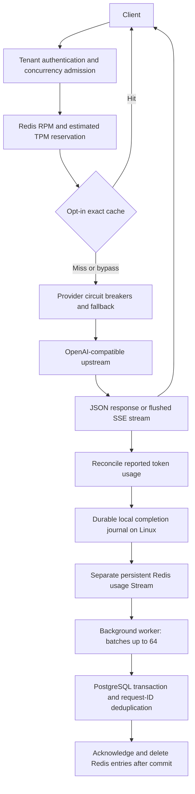

# Janus

[](https://github.com/Shikhar-24100/janus-proxy/actions/workflows/ci.yml)

A Go LLM gateway with streaming, tenant quotas, provider fallback, exact caching,
and durable usage history. Clients use a text-only subset of
`POST /v1/chat/completions`; upstreams speak the OpenAI-compatible API.

**Status: portfolio MVP.** The main features work and have integration, crash,
and load tests. Production readiness and the 5–10 ms overhead target remain open.

## Try the demo without API keys

Requires Docker Compose, or Ubuntu WSL with Docker Engine on Windows.

```powershell
.\demo.ps1
```

On Linux/macOS:

```sh
docker compose -f compose.demo.yaml run --rm --build demo
docker compose -f compose.demo.yaml down --volumes
```

This runs a narrated set of executable test scenarios with fake providers and
separate disposable Redis/PostgreSQL services. It demonstrates authentication,
streaming before generation finishes, rate limiting, cache hits, fallback,
tenant isolation, metrics/privacy, usage deduplication, and crash recovery.
No provider keys, real provider calls, or published ports are needed.
See the [demo walkthrough](docs/demo.md) for the expected results.

## Run with a provider

From the repository root on Windows:

```powershell
Copy-Item .env.example .env
# Edit .env: set OPENAI_API_KEY and your own JANUS_API_KEY.
.\containers.ps1 -Action init  # once; never overwrites existing configuration
.\containers.ps1 -Action up
```

The container gateway listens on `http://localhost:8081`. Keep Ubuntu/WSL active
while using its Docker Engine. After initialization, edit `.env.container` and
`.container/tenants.json` for container settings; changing `.env` does not update
those copies. Use `-Action down` to stop the stack; persistent volumes remain.

For the native Windows gateway, start the development services with
`start-redis.ps1` and optionally `start-usage.ps1`, then run `run.ps1`.
The native gateway defaults to port 8080; its durable local outbox requires Linux.
Go users can run `go run ./cmd/janus` with configuration exported as environment
variables. See [container setup](docs/containers.md) and [startup troubleshooting](docs/startup.md).

Request examples are in [examples](examples/). Keep credentials in ignored local
configuration or environment variables. The gateway does not automatically load
`.env`; the Windows launch script does.

## Architecture



The quota/cache Redis and usage Redis are separate services with different
persistence needs. Streaming responses are forwarded as received; RPM/TPM govern
request admission, not response event speed. Usage persistence happens at handler
completion. Read the [detailed lifecycle](docs/architecture.md).

## Repository layout

```text
cmd/janus/              executable entrypoint
cmd/loadtest/           fake providers and load-test client
internal/gateway/       gateway implementation and colocated tests
  migrations/          embedded initial usage schema
examples/               request payloads and tenant configuration template
queries/                usage reporting SQL
scripts/                portable demo and load-test helpers
docs/                   architecture, operations, demo, and design notes
.github/workflows/      automated verification
compose*.yaml           normal, disposable demo, and isolated load fixtures
*.ps1                   Windows launch, demo, reporting, and benchmark commands
```

## Verification

```sh
go test ./...
go vet ./...
go build ./cmd/...
```

Redis/PostgreSQL integration tests require `REDIS_TEST_URL` and
`POSTGRES_TEST_URL`; otherwise they skip. On Windows, `containers.ps1 -Action test`
runs the complete Linux suite with those services. GitHub CI runs race-enabled
integration tests, the demo, Linux/Windows compilation, and a runtime image build.
Live-provider tests are opt-in and remain disabled in CI.

Use `loadtest.ps1` for isolated fake-provider load tests; no paid APIs are used.
Existing measured results are summarized in [worker tuning](docs/usage-worker-tuning.md)
and [journal batching](docs/group-commit.md). Results are local observations,
not a production capacity guarantee; JSON latency results were mixed.

## Release boundaries

- Text messages only; no tool calling, multimodal inputs, or native Anthropic/Gemini adapters.
- One primary and one fallback; no weighted routing or semantic cache.
- Input tokens use a byte heuristic. Reported provider usage reconciles reservations;
  accurate model tokenizers remain future work.
- Exact caching is opt-in and limited to eligible non-streaming primary responses.
- A crash during generation or before journal confirmation can leave missing usage.
  Disk loss, replication, and invoice reconciliation are outside this guarantee.
- Startup tenant configuration supports isolation/rotation; live administration and
  dollar budgets remain future work. Stored token history is not an invoice ledger.
- TLS termination, managed secrets, backups, production soak tests, and stable latency
  verification are deployment work, not completed by this MVP.

See [release checklist and limitations](docs/release.md), [contributing](CONTRIBUTING.md),
and the [documentation index](docs/README.md).
