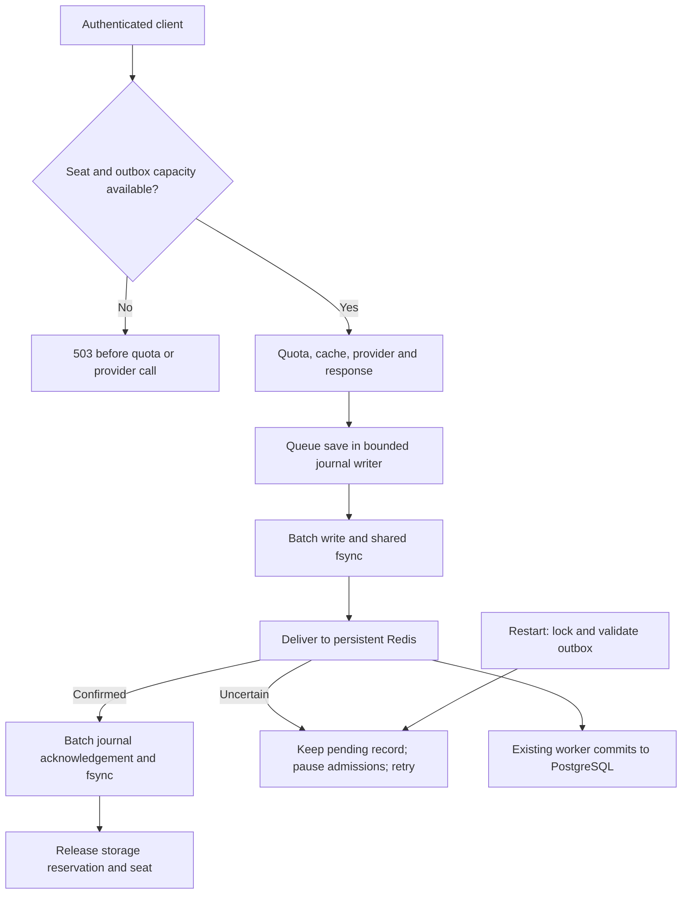

# Durable usage outbox and restart recovery

## Why this exists

The retry channel protects against temporary Redis failures while Janus is
running. Memory disappears on a hard process kill. The outbox adds a local
durability boundary: a completed accounting event is recoverable after its
journal frame has been successfully flushed to persistent storage.

An outbox is a collection of records waiting for delivery. PostgreSQL is still
the reporting database; Redis is still the persistent delivery queue. The local
outbox bridges the handoff to Redis. It stores only the existing accounting
metadata, never message content, generated answers, or credentials.



## Journal lifecycle

The current outbox uses one append-only `journal.v1`, rather than one file per
request. A bounded writer channel collects up to 32 save/acknowledgement
operations, waiting up to 1 ms to form each batch. One file write and `fsync`
confirms the batch together. Queueing, disk sync and compaction can add further
waiting; the 1 ms collection window is not a total latency guarantee.

Each frame contains a version marker, payload length, CRC32 checksum and JSON.
A save contains validated accounting metadata; an acknowledgement contains the
original request ID after Redis confirms delivery. Callers wait for their batch
confirmation. The live index changes only after successful disk sync.

Startup takes an exclusive Linux lock, validates the journal and rebuilds
pending events by applying saves and acknowledgements in order. A short trailing
header/payload is truncated and flushed. Complete corrupt frames stop startup
and are retained for inspection. Complete unconfirmed frames may survive and
replay safely with database deduplication. No model is called during replay.

Failed writes close admission. Before another append, the writer truncates to
its last confirmed offset and flushes that repair. Compaction replaces delivered
history with a flushed checkpoint containing only pending events, then syncs the
directory. Both old and new files describe the same pending set during replacement.

Existing SHA-256-named JSON files are imported into the journal and flushed before
deletion. Interrupted migration may repeat delivery but preserves original IDs.
The old binary cannot read this new journal. See [group commit](group-commit.md).

The same request ID survives every retry and restart. Redis's recent-handoff
marker reduces repeated deliveries; PostgreSQL's permanent primary key prevents
duplicate accounting if Redis receives an event again, including after the
marker expires. The SQL worker may still be writing after journal acknowledgement; at that
point persistent Redis owns recovery.

## Configuration and limits

The normal Linux Compose stack and the load-test fixture enable:

```text
USAGE_OUTBOX_DIR=/var/lib/janus/outbox
USAGE_OUTBOX_MAX_MB=32
```

The normal stack uses the named `outbox-data` Docker volume. For a custom path,
its parent directory must already exist on persistent Linux storage. Each replica needs
its own directory/volume; do not share it between simultaneous replicas. Container
recreation preserves the volume. Removing volumes deliberately deletes recovery
data. Outbox data is excluded from Git and Docker build inputs.

The 32 MiB setting allows 2048 event slots of at most 16 KiB each. Admission
reserves a slot before invoking the chat handler. Existing records plus active
reservations consume capacity conservatively. A full outbox rejects arrivals
with the existing 503 response. Journal history, checkpoints, metadata and filesystem
allocation overhead are additional disk usage: this is a logical event-payload
bound, not a partition quota or a guarantee that the host has free disk space.

A disk write/flush failure closes admission and retries the affected event.
That event is still only in memory until a subsequent write succeeds. Existing
streams follow their usual completion and cancellation behavior. File sync is
a blocking OS operation; the separate 200 ms Redis budget begins after local
persistence and cannot interrupt a disk sync.

Leaving `USAGE_OUTBOX_DIR` empty preserves the earlier in-memory handoff mode.
An enabled outbox requires Redis and PostgreSQL usage storage. The durable
implementation requires Linux filesystem locking and directory fsync; use
the Linux container stack from Windows. Native Windows mode leaves it disabled.

## Observability

Authenticated `/metrics` exposes `janus_outbox_records`, `janus_outbox_bytes`,
`janus_outbox_reserved`, `janus_outbox_capacity_bytes`, `janus_outbox_blocked`,
`janus_outbox_writes_total`, `janus_outbox_errors_total`, and
`janus_outbox_replayed_total`. Counters reset on restart; records remain on disk.
The `janus_outbox_write_duration_seconds` histogram measures local writes and
flushes, including queue and batch waits. The existing usage-enqueue stage now includes
local persistence, Redis confirmation, and confirmed journal acknowledgement on its
fast path. Completion latency can rise; first-token streaming still precedes
the completion outbox write.

## Verification and remaining boundaries

Tests kill a real subprocess after local confirmation, reopen its outbox and
replay into Redis/PostgreSQL. They cover both a missing database record and an
already committed record. Further tests cover capacity reservations, admission
rejection before the handler, exclusive ownership, corruption, and injected
file-flush failure preventing premature Redis delivery. Journal tests also
cover partial appends, checksum damage, migration and compaction failures.

Concurrency tests verify queued operations share a durable flush and
same-request publishers write once. Shutdown waits for active publishers before
releasing exclusive ownership. An unconfirmed record survives shutdown and
replays on reopening. Slow local flushing does not consume Redis's timeout.

A crash during generation or before local confirmation still leaves an
accounting gap. This is a completion outbox, not a durable request-start journal.
Disk/volume loss, storage that does not honor fsync, and hardware failure are
outside this guarantee. Backups, replication and provider invoice reconciliation
remain necessary production work. Saved events are metadata, not a way to
reconstruct or resume an interrupted model response.

## Historical per-file measurements

Separate-container fake-provider load phases ran for 10 seconds each. These
measure successful-response completion latency including upstream time and
client scheduling lag; deliberate 503 responses are counted separately.

| Gateway mode | Offered RPS | Accepted / offered | Rejected | Completion p50 / p99 | First-text p99 |
|---|---:|---:|---:|---:|---:|
| JSON | 200 | 2000 / 2000 | 0 | 16.59 / 54.79 ms | n/a |
| SSE | 200 | 2000 / 2000 | 0 | 19.01 / 44.95 ms | 8.26 ms |
| JSON | 1000 | 8757 / 10000 | 1243 | 33.10 / 59.02 ms | n/a |
| SSE | 1000 | 5829 / 10000 | 4171 | 46.33 / 151.11 ms | 87.62 ms |

All 18586 admitted requests had matching PostgreSQL request, attempt and token
totals. All outbox files, retained handoffs and Redis entries drained. There
were no transport drops, invalid responses, terminal handoff errors, worker
errors, outbox errors, or handoff retries in this run. It used no paid APIs.
Mean local write-stage times were 2.48/3.10 ms at 200 RPS (JSON/SSE), and
7.53/6.68 ms at 1000 RPS. These include local lock waits but exclude local deletion.

An earlier implementation serialized all disk flushes and admitted only 2495
JSON and 1974 SSE requests at 1000 RPS, with p99 of 260.67 and 317.31 ms.
Allowing independent files to flush concurrently improved those results.
The Redis budget also now starts after disk persistence.

The prior no-outbox 30-second run admitted 29744/30000 JSON and 29368/30000 SSE
requests at 1000 RPS, with p99 36.50/48.62 ms. The runs have different durations
and share the laptop's WSL resources, so this is not a controlled overhead
comparison. It does demonstrate a substantial throughput cost from durable
file writes. The 5-10 ms proxy-overhead goal remains unfinished. The current
batched journal is intended to reduce flush work, but its performance still
needs measurement; production capacity requires longer tests and representative storage.

These historical raw reports are in `.cache/loadtest-before-group-commit/`; earlier outbox-serialized reports
are in `.cache/loadtest-outbox-serial/` and no-outbox reports in
`.cache/loadtest-before-outbox/`.
