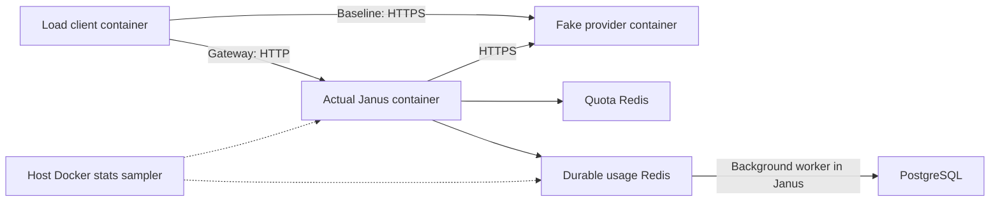

# Separate-container load testing

The measurements below predate admission protection and the durable outbox. The current gateway uses
32 seats and can deliberately reject load with 503. Use `-AllowOverload` to test
admitted-response/accounting correctness under saturation; omit it to require
every arrival to succeed. See [the new design and measurements](overload-protection.md).

Run from the repository in PowerShell with Ubuntu WSL and Docker Engine:

```powershell
# Quick check: 12 ten-second phases, plus builds and startup.
.\loadtest.ps1
# Sustained baseline: 30 seconds per phase.
.\loadtest.ps1 -DurationSeconds 30 -Rates '50,200,500' -MaxInflight 256
# Stress level that exposed overload (may fail).
.\loadtest.ps1 -DurationSeconds 10 -Rates '1000'
```

The script builds the real Janus runtime image and independent client and fake
provider images. It starts project `janus-loadtest`, gathers reports, and stops
that project's containers. Private database volumes remain; usage checks use
before/after differences. The ordinary `janus-linux` stack stays separate.
Run one load test at a time. Reports overwrite previous results; copy them first
to preserve comparisons. No `.env` file or real key enters the services.
Dummy keys and a private Docker network without an Internet route prevent paid
API calls. The fake provider uses a generated test certificate; Janus retains
normal HTTPS verification. Do not reuse fixture credentials in deployment.



## Method

An **open-loop** client schedules a request every `1 / rate` seconds regardless
of previous responses. At 200 RPS, one request arrives every 5 ms. A semaphore
limits outstanding requests; lack of a slot is a counted error/drop. The test
does not quietly slow its arrival rate when the server slows. Scheduling delays
are recorded, and delayed arrivals are sent late rather than forgotten.

Each rate runs direct JSON, gateway JSON, direct SSE and gateway SSE in sequence.
Twenty warmup requests per scenario are excluded. The fake provider waits 10 ms
for JSON. SSE flushes a role event immediately, sends `hello` after 3 ms, then
usage and `[DONE]` after another 7 ms. Timers can run late under load; the direct
baseline measures that too. Cache and fallback are not requested. High quotas
exercise the admitted path, including Redis admission/settlement and durable
usage handoff.

* Completion latency starts at scheduled arrival and ends at body EOF. It
  includes scheduler lag, network/provider work and handler completion.
* TTFT ends at a complete SSE event with visible content; role events and
  incomplete network chunks are not tokens.
* Percentiles include successful responses only. Failures and drops stay in
  the counts and CSV. Throughput includes the final request drain time.
* Median differences are comparisons, not paired per-request overhead or a p99
  overhead guarantee. The client uses HTTP/1.1; Janus's existing upstream
  transport can negotiate HTTP/2 with the TLS fixture. Connection behavior is
  part of the comparison.
* Janus has two CPUs, GOMAXPROCS=2, a 256 MiB limit and a 192 MiB Go memory
  target. The client has two CPUs and the fixture has one. All services share
  the WSL host with other applications.

The host samples only Janus's Docker CPU/memory stats, roughly every three
seconds, plus usage stream length. On Linux, 100% CPU is roughly one CPU worth
of work. Docker's memory figure excludes reclaimable cache and is not Go heap.
Sampled maxima can miss spikes. Timestamps are taken after collection, so
boundary observations may include adjacent phases. See [Docker stats](https://docs.docker.com/reference/cli/docker/container/stats/).

After each phase the client waits up to 30 seconds for no chat handlers, an
empty usage stream and persisted deliveries catching up with enqueued events.
It checks enqueue/worker/invalid-event errors, handoff counts, and PostgreSQL
request/attempt/token deltas. Every successful gateway request should create
one request, one attempt and 15 total tokens; direct requests should create none.
Warmups finish before those snapshots. The fixture expects every response to
succeed; non-200 or malformed/truncated responses fail the phase.

## Reports

Ignored files in `.cache/loadtest/`:

* `results.md`: latency, TTFT, throughput, scheduling lag, CPU/memory and backlog.
* `results.json`: timestamps, errors/drops, usage row deltas, validation status
  and before/after metrics including stage histogram sums/counts.
* `samples.csv`: every measured response, including errors.
* `resources.jsonl`: timestamped Docker stats and queue lengths.
* `fixture.log` and `gateway-state.json`: bounded logs and state captured before
  shutdown. These services only receive dummy keys.

A nonzero exit means validation failed. Partial reports remain. An early
startup failure can leave fixtures running; stop them in Ubuntu with
`docker compose -p janus-loadtest -f compose.loadtest.yaml down`.
Tiny answers and short streams do not establish production capacity for long
generations, slow clients, outages or multiple replicas.

## Measurements: October 6, 2026

The first ten-second ramp passed response and usage checks at 50 and 200 RPS,
but failed at 1000 RPS:

| Gateway path | Scheduled | Complete responses | p50 / p99 ms | Unconfirmed usage handoffs | Saved requests |
| --- | ---: | ---: | ---: | ---: | ---: |
| JSON | 10000 | 10000 | 15.44 / 206.33 | 23 | 10000 |
| SSE | 10000 | 8128 | 19.97 / 782.69 | 1631 | 6695 |

All 1872 SSE response errors were client inflight-limit drops that never reached
Janus. EOF backlogs were 471/2243 and subsequently drained. The unconfirmed JSON
events were saved, but 1433 complete SSE responses had no saved request at the
post-drain check. An empty queue alone does not prove complete accounting.
Retained stress summaries/metrics/resources are in
`.cache/loadtest-stress-1000/`. Its raw CSV was discarded while recovering disk
space; the sustained run's raw samples remain.

This exposes the existing bounded enqueue limit: after sending the response,
failure to confirm a Redis handoff can leave an accounting gap. The harness
detects that limit; it does not repair delivery. Mean usage enqueue was about
1.3 ms at 200 RPS, 7.6 ms for JSON at 1000 RPS and 77.4 ms for SSE at 1000 RPS.
Mean quota admission rose to 16.5 ms in the SSE stress phase. Investigate CPU,
Redis waits, fsync and worker throughput; these times do not prove one cause.
Bounded admission and retained retries now address these failure paths; see
[the updated design and measurements](overload-protection.md). Worker throughput
and crash-safe handoffs remain follow-up work.

The sustained run used Go 1.27.1, Docker Engine 29.1.3 and Ubuntu WSL with the
actual Alpine runtime image and the limits above. Thirty seconds per phase at
50/200/500 RPS completed **90000 requests without response errors or drops**.
All **45000 gateway requests** had matching PostgreSQL request/attempt rows and
**675000 tokens**. No enqueue/worker/invalid-event errors or log drops occurred;
all queues drained. These counts exclude warmups.

| RPS | Direct JSON p50 / p99 ms | Gateway JSON p50 / p99 ms | Direct TTFT p50 / p99 ms | Gateway TTFT p50 / p99 ms | Gateway SSE completion p50 / p99 ms |
| ---: | ---: | ---: | ---: | ---: | ---: |
| 50 | 11.64 / 12.87 | 14.23 / 19.05 | 4.58 / 5.62 | 5.24 / 7.39 | 14.39 / 20.07 |
| 200 | 11.60 / 12.92 | 14.71 / 25.75 | 4.31 / 5.49 | 5.91 / 9.38 | 16.09 / 27.15 |
| 500 | 11.40 / 12.64 | 15.81 / 37.75 | 4.51 / 5.69 | 5.75 / 50.82 | 16.74 / 152.54 |

JSON median differences are 2.59/3.11/4.41 ms. Medians look promising for this
small workload, but tail latency remains unfinished: at 500 RPS, streaming
TTFT p99 is 50.82 ms and completion p99 is 152.54 ms. This is not an SLO pass.

| Gateway phase | RPS | CPU sampled mean / max % | Memory sampled max MiB | Queue sampled max / EOF |
| --- | ---: | ---: | ---: | ---: |
| JSON | 50 | 10.9 / 13.8 | 9.7 | 1 / 1 |
| SSE | 50 | 13.4 / 15.0 | 10.1 | 0 / 1 |
| JSON | 200 | 42.3 / 54.7 | 10.2 | 2 / 1 |
| SSE | 200 | 62.2 / 71.9 | 11.1 | 2 / 1 |
| JSON | 500 | 81.5 / 98.9 | 15.2 | 13 / 4 |
| SSE | 500 | 102.5 / 161.9 | 22.2 | 200 / 34 |

Each gateway phase has 9-11 observations. Sampled queue maxima can be lower than
EOF lengths because they are separate observations.

The first sustained build was interrupted by a WSL restart before measurement;
its cause was not established. A retry completed the run above. During final
verification C: filled completely, causing WSL filesystem errors. Clearing
generated project Go build caches recovered about 2.8 GB and Ubuntu/Docker
started again. Latest reports and source were preserved; this note was restored
after an interrupted write. The retry's Linux Go suite, Redis/PostgreSQL
integration checks and vet passed. Regenerating the final report twice produced
identical SHA-256 hashes for both JSON and Markdown output.
