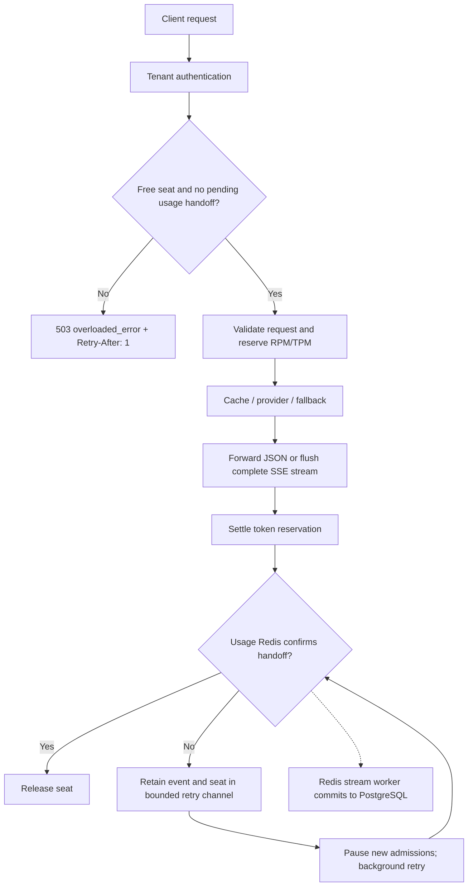

# Overload protection and usage recovery

## The problem

RPM controls requests over a minute. TPM controls token allocations. Neither
limits requests running at the same time. In the earlier 1000 RPS test, long
Redis waits accumulated, clients reached their inflight limit, and some complete
responses had no stored usage at the post-drain check.

Janus now has a per-process concurrency gate, configured by `MAX_INFLIGHT`
(default 32; valid range 1-4096). This is a Go buffered channel, not another
Redis round trip. One entry means one held admission seat. All tenants share
the gate; Redis still enforces each tenant's RPM/TPM independently.



## What happens to a request

With a limit of 32, requests 1-32 can obtain seats. If all seats are held,
request 33 gets HTTP 503 immediately, before JSON decoding, quota charging,
cache lookup or a provider call. Its response is ordinary OpenAI-style error
JSON, even if the request asked for streaming:

```json
{"error":{"type":"overloaded_error","message":"Janus is busy or usage delivery is recovering. Retry later."}}
```

`Retry-After: 1` suggests waiting at least a second; clients should also add
jitter when retrying together. Invalid keys still get 401. Health and metrics
remain accessible while admission is full. Rejections appear in metrics/logs,
but do not create usage database rows or consume RPM/TPM.

An admitted stream is not cut off to make room for another request. It continues
with normal flushes, cancellation, output allowance and provider failure rules.
A seat is released after handler completion and confirmed usage handoff. When
usage storage is disabled, it is released at handler completion.

## Why uncertain handoffs need a retry

Redis can accept `XADD` while the acknowledgement gets lost. Treating that as
definitely failed is wrong; blindly appending again creates extra deliveries.
The enqueue Lua script now checks a recent-handoff key for the same request ID.
It atomically appends the event and remembers its stream ID for 30 seconds.
A quick retry returns that ID, even if the worker already saved and deleted the
stream entry. Both keys live in the same standalone usage Redis.

The short marker is an optimization, not permanent accounting identity. If it
expires during a long outage, a later retry can append a duplicate. PostgreSQL's
request-ID primary key and transactional inserts still prevent duplicate token
records. Internal retries reuse the original event and request ID; they never
call the model again. Separate client retries are separate requests.

The fast path keeps the existing 200 ms confirmation budget. An unconfirmed
event goes into a retry channel sized to the admission limit. One additional
goroutine retries retained jobs with 50 ms backoff, doubling up to one second.
The database worker is a different goroutine. While any handoff is pending,
new requests get 503. Already admitted requests can finish and retain their
events too. Their seats remain held until confirmation, bounding retained
events by admitted work. There is no unbounded memory spool.

With the Linux [durable outbox](durable-outbox.md) enabled, an event is flushed
locally before Redis delivery and unfinished files replay after restart. Without
it, retained events remain in memory until Redis confirms them. A crash before
local confirmation, including during generation, can still leave missing usage.
Shutdown cancels retries and reports unconfirmed jobs; confirmed files remain
recoverable. A request-start journal and invoice reconciliation remain future
work. This is not lossless billing.

## Metrics and configuration

Add `MAX_INFLIGHT=32` to `.env` for Windows or `.env.container` for the normal
Linux stack, then restart Janus. Omitting it uses 32. The load fixture explicitly
sets 32. Raise it only after measurements; more seats can increase Redis waits.
The limit applies per replica, not across a deployment, and does not provide
per-tenant concurrency fairness.

Authenticated `/metrics` adds:

* `janus_admission_limit`: configured seats.
* `janus_admission_active`: held seats, including completed requests awaiting
  usage confirmation.
* `janus_overload_rejections_total`: rejected arrivals.
* `janus_usage_pending_handoffs`: retained/in-progress retry jobs.
* `janus_usage_enqueue_retries_total`: failures that trigger another attempt.

`janus_usage_enqueue_errors_total` now counts terminal invalid events and
unconfirmed jobs at shutdown. A recovered timeout increments the retry counter,
not the terminal-error counter. Worker errors remain separately visible.
Handoff marker keys expire automatically; the persistent stream is never
trimmed to make room for new events.

## Verification

Tests check a full gate leaves the admitted SSE stream intact, rejected and
unauthenticated requests never invoke the handler, cancellation frees a seat,
a Redis reply lost after commit does not append twice, a full queue retains its
event and closes admission, recovery reopens admission, and shutdown exposes
unconfirmed jobs without leaking seats.

```powershell
.\containers.ps1 -Action test
.\loadtest.ps1 -DurationSeconds 10 -Rates '200,1000' -AllowOverload
```

`-AllowOverload` recognizes only well-formed gateway 503 overload responses as
intentional rejections. It still fails on truncated/invalid responses, client
drops, transport errors, terminal handoff errors, worker errors or missing/
duplicate usage. It verifies every admitted 200 response against PostgreSQL,
and waits for held seats, pending handoffs and the durable stream to drain.
Without the switch, any rejected request fails the capacity test as before.
Successful-response percentiles exclude rejected requests; counts stay visible.

### Local measurements

A 30-second-per-phase run at 200 and 1000 RPS used separate Linux containers
and a fake provider, so it spent no API credits. At 200 RPS, both gateway phases
accepted all 6000 requests. At 1000 RPS:

| Gateway response | Accepted / scheduled | Rejected with 503 | Completion p50 / p99 |
|---|---:|---:|---:|
| JSON | 29744 / 30000 | 256 | 16.66 / 36.50 ms |
| SSE | 29368 / 30000 | 632 | 17.97 / 48.62 ms |

Across the four gateway phases, all 71112 accepted responses had matching
PostgreSQL usage records. There were no client drops, invalid responses,
terminal handoff errors or worker errors. Queues and retained handoffs drained.
Injected tests exercise uncertain acknowledgement and retry recovery; this
load run did not itself require handoff retries.

At 1000 RPS the SSE stream queue still had 3723 entries at the end of arrivals,
before draining. Admission improves behavior under pressure; the database
worker still needs throughput work. The 5-10 ms overhead target remains
unfinished. These are successful-response completion latencies, including
the fake upstream and client scheduling lag, not isolated proxy overhead or
a production capacity guarantee. Raw local reports are in `.cache/loadtest/`.
